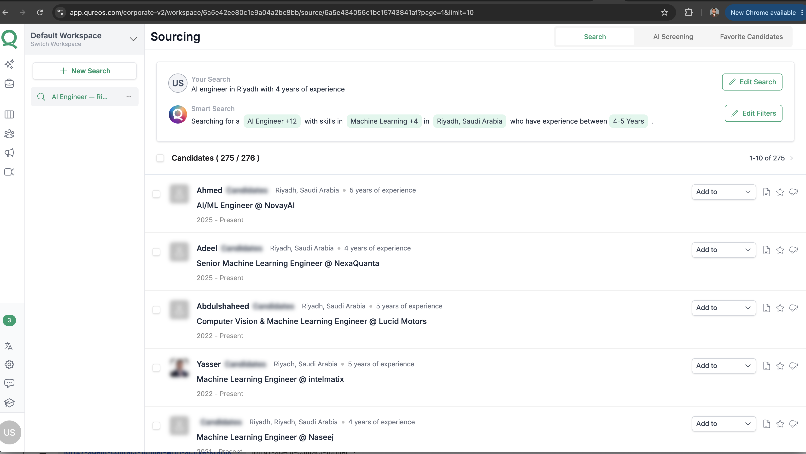
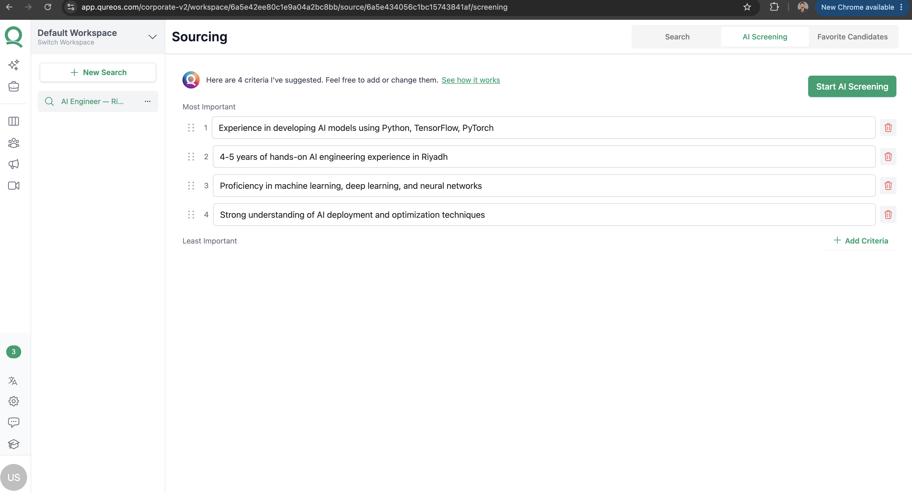
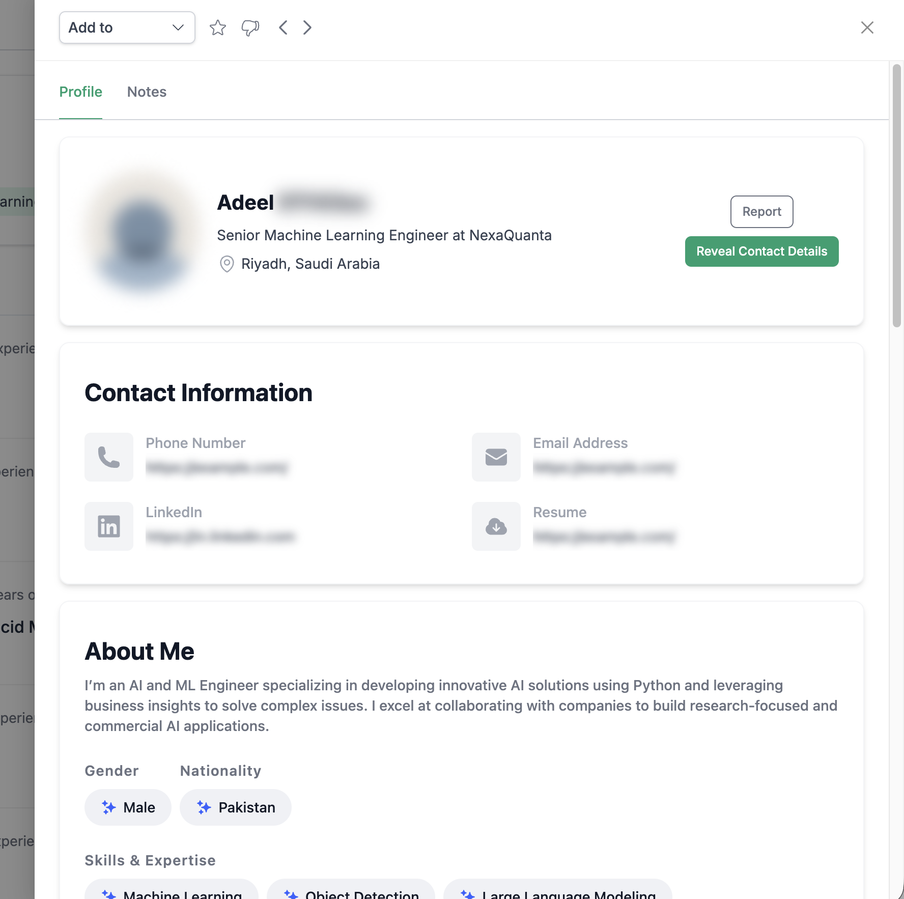

# Urwah Sajjad

Senior Full-Stack Engineer based in Riyadh, Saudi Arabia.

[LinkedIn](https://www.linkedin.com/in/urwah-sajjad-9b587470/) · [GitHub](https://github.com/usajjad123)

## Skoop

Senior Full-Stack Engineer · May 2026 - Present  
[View product](https://myskoop.com/)

I joined early and built much of the backend behind the product.

- Built the system that finds and verifies missing phone numbers and emails for leads. It recovered about 36% of unresolved contacts and added roughly 2,700 usable records.
- Built the backend and data model for contacts, properties, agents, and reports.
- Built the email system for intro and report emails, including unsubscribe handling, A/B tests, scheduled batches, and a small internal page for manually running and monitoring sends.

## Bluefin / Seed Labs

Senior Software Engineer · Aug 2025 - Apr 2026  
[View product](https://trade.bluefin.io/)

Bluefin is a decentralised exchange. I worked across both the visible trading experience and the systems behind it.

- Reworked an acquired DEX aggregator and reduced its infrastructure cost from roughly $30-40K/month to around $3K/month.
- Improved the routing system's P95 latency from 1.2 seconds to about 300ms.
- Built an RFQ system spanning backend APIs, quote caching, a Rust SDK, and a TypeScript SDK.
- Worked on the Spot/swap screen redesign and the quote API that supplies swap quotes to the UI.
- Maintained services supporting roughly $120M in biweekly trading volume across 20+ AMMs.

## Qureos

Full-Stack Engineer (via Remotebase) · Jan 2022 - Jun 2024  
Product Engineer (direct hire) · Jul 2024 - Mar 2025  
[View product](https://app.qureos.com/)

Qureos is a hiring platform. I worked on candidate sourcing, AI-assisted screening, and internal recruiting tools.

- Built an AI candidate-screening workflow that improved top-of-funnel engagement by 25%.
- Built an AI job-description generator that was later white-labelled, generating more than $4K in annual revenue.
- Built a talent-team portal that reduced candidate CV review and hiring-process time by 60%.
- Worked with customer success on client requests; three clients converted to quarterly subscriptions.

### Screenshots

The Qureos product requires login. Add these images to an `assets/` folder when publishing this page:

*Candidate sourcing: search results filtered by role, location, skills, and experience.*

*AI screening: recruiters can review and edit the criteria used for a role.*

*Candidate profile: contact details, resume, LinkedIn, and candidate information in one place.*
